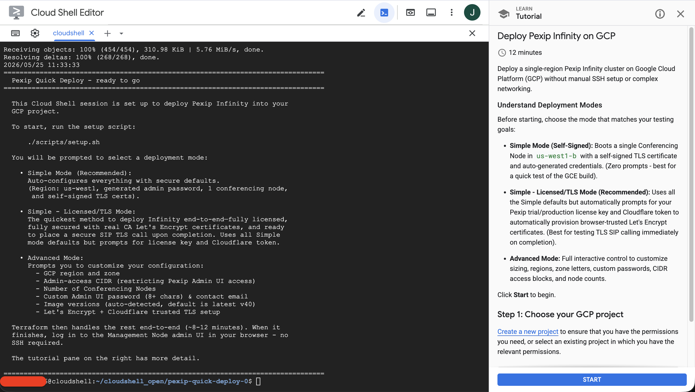
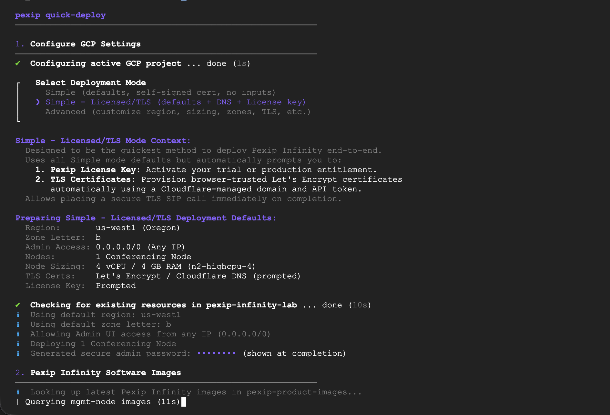

# Pexip Quick Deploy for Google Cloud Platform

[](https://shell.cloud.google.com/cloudshell/open?cloudshell_git_repo=https://github.com/JoshEstrada-Pexip/pexip-quick-deploy-gcp.git&cloudshell_tutorial=tutorial.md&cloudshell_print=WELCOME.txt&shellonly=true)

Deploying [Pexip Infinity](https://docs.pexip.com/admin/admin_intro.htm) can be a complex task. This project aims to simplify that by providing a ""couple-of-clicks" deployment method on Google Cloud Platform (GCP) using the built-in cloud shell. This tool handles copying the GCP images and bootstrapping the Management and Conference Nodes, avoiding the need to SSH and run the initial CLI installer. It will also provide the option to run a secondary script that provisions the platform with a "base configuration". Allowing for secure SIP calling out-of-the-box.

NOTES:

* This tool is a community tool, not licensed nor officially provided by Pexip. It has been modified to use modules from the [official Terraform Pexip Provider](https://registry.terraform.io/providers/pexip/pexip/latest/docs).
* It uses the latest [official Pexip published GCP images](https://docs.pexip.com/admin/gcp_disk_images.htm#obtain) which are v.40 at the time of publishing this. Image names/versions can be easily modified inside the terraform.tfvars file.

---

## Prerequisites

### 1. GCP Project & IAM Permissions

* **GCP Project**: A Google Cloud project with **billing enabled**.
* **IAM Permissions**: The user (or identity) running the deployment needs:
  * **Standard Option:** The **Project Editor** (`roles/editor`) or **Project Owner** role.
  * **Least-Privilege Option:** If you require restricted permissions, grant the following standard GCP roles:
    * **Compute Admin** (`roles/compute.admin`)
    * **Service Account Admin** (`roles/iam.serviceAccountAdmin`)
    * **Service Account User** (`roles/iam.serviceAccountUser`)
    * **Service Usage Admin** (`roles/serviceusage.serviceUsageAdmin`) *(only needed to automatically enable the required Compute/IAM APIs)*

### 2. Execution Environment

* **Google Cloud Shell (Recommended):** Zero setup required. All dependencies (`gcloud`, `terraform`, `curl`, `python3`) are pre-installed.
* **Local Machine (macOS/Linux):** You must install the `gcloud` CLI (pre-authenticated), Terraform CLI (v1.0.0+), `curl`, and `python3`.
  * *Note for macOS / Python 3.13+:* If deploying locally, install `passlib` to support password hashing: `pip install passlib`.

### 3. Pexip License

* A Pexip Infinity license (request a free 30-day trial at [https://developer.pexip.com/request-developer-license/](https://developer.pexip.com/request-developer-license/)).

### 4. Optional Cloudflare Token (For Let's Encrypt TLS)

* A domain managed in Cloudflare and a Cloudflare API Token with `Zone.DNS:Edit` permissions. Cloudflare is the only DNS provider supported in this initial release, but other DNS providers can be added using offical Terraform providers and modules. I plan to add more soon.

---

## Quick Start

### 1. Launch in Google Cloud Shell

Click the **Open in Cloud Shell** badge above. This clones the repository and starts the guided walkthrough tutorial.



### 2. Run the Deployment

Run the setup script [setup.sh](scripts/setup.sh) by executing:

```bash
./scripts/setup.sh
```

Select one of the following deployment modes in the wizard:

* **Simple**: Zero inputs required. Instantly boots a single conferencing node in `us-west1-b` with self-signed TLS and an auto-generated admin password (printed at completion).
* **Simple - Licensed/TLS**: Designed to be the fastest way to deploy Pexip Infinity end-to-end—fully licensed, secure, and ready for SIP TLS calling with valid CA certificates on completion, but remember you will need a Cloudflare domain. It uses all the automated Simple mode defaults (region, machine sizing, and generated credentials) but prompts you for:
  - **Pexip License Key**: Activates your trial or production entitlement.
  - **TLS Certificate Info**: Automatically provisions browser-trusted Let's Encrypt certificates using a Cloudflare-managed domain and API token.
* **Advanced**: Provides full interactive control to customize the GCP region, machine sizing, instance counts, admin access IP restrictions, password credentials, and optional custom image overrides or TLS config.



### 3. Access the Admin UI

once the setup script completes (12-15 minutes while VMs provision), it will output the login details in the shell:

```
Admin UI:   https://<manager-public-ip>/admin/
Username:   admin
Password:   (the password you specified or that it generated during setup)
```

1. Open the Admin UI URL.
2. Bypass the TLS warning (if using the default self-signed certificate, click Advanced > Proceed).
3. Apply your license if needed and configuration using **Stage 2: Declarative Configuration** (see below), or log in manually and configure them via the web UI.

## Stage 2: Declarative Platform Configuration

After the GCP infrastructure is successfully deployed, you can also use the declarative configuration tool to bootstrap your license, Virtual Meeting Rooms (VMRs), and call routing rules automatically without clicking through the GCP web UI.

### 1. (Optional) Customize Settings

The `setup.sh` wizard automatically creates `pexip-config.yaml` in the workspace root and pre-populates it with the license key you entered.

If you want to customize your deployment (e.g., customize VMRs, add real admin users, edit call routing rules), open the file using the built-in GCP cloud shell editor or use another text editor if needed

Example:

```bash
nano pexip-config.yaml
```

Configure any of the following fields:

- **License key**: Paste your trial/production activation key under `license_key` (if not already licensed).
- **VMRs**: Define names, descriptions, pins, layout views, and unique dial aliases for your Virtual Meeting Rooms.
- **Gateway routing rules**: Create dial plan rules using PCRE regular expression matches to route unmatched calls onward to services like Google Meet or Microsoft Teams.
- **End Users**: Define administrative or personal contact records in the directory under `users` with their email, display name, and department.
- **Device Aliases**: Register video endpoints and software clients under `device_aliases` with their registration credentials and optional primary owners.

### 2. Synchronize Configuration

Run the sync script. It automatically retrieves the Management Node's public IP from Terraform, extracts the password from `terraform.tfvars`, and synchronizes settings idempotently:

```bash
./scripts/configure-platform.sh
```

The script will report which resources were created, updated, or skipped. You can safely modify `pexip-config.yaml` and re-run this script at any time to sync updates.

---

## Tearing Down

To remove all deployed resources and stop billing, run the destroy script [destroy.sh](scripts/destroy.sh):

```bash
./scripts/destroy.sh
```

---

## Customization Options

### Region and Node Scaling

You can specify the primary deployment region and scale the number of Conferencing Nodes during the interactive script prompts.

### Let's Encrypt TLS Certificate (Opt-in)

Select `y` at the TLS prompt to automatically configure Let's Encrypt certificates using Cloudflare DNS-01 verification. This enables browser-trusted HTTPS access without warnings.

### Private Deployment

To deploy Conferencing Nodes with internal-only IPs (for VPN or VPC peering environments), configure `conf_nodes_public = false` in [terraform.tfvars](terraform/terraform.tfvars) before deploying.

---

## Technical Reference and Troubleshooting

<details>
<summary>CLI Prompts Reference</summary>

Here is the list of prompts presented by [setup.sh](scripts/setup.sh) (some may be bypassed depending on your chosen deployment mode):

| Prompt                       | Default               | Description / Notes                                                                                     |
| ---------------------------- | --------------------- | ------------------------------------------------------------------------------------------------------- |
| GCP project ID               | (Pre-filled)          | GCP project for resources (all modes).                                                                  |
| Select Deployment Mode       | `Simple`            | Choose between `Simple`, `Simple - Licensed/TLS`, and `Advanced`.                                 |
| Primary region               | `us-west1`          | Region for the network and VMs (Advanced mode only).                                                    |
| Admin UI CIDR                | (Blank)               | Laptop IP as `<ip>/32`. Blank allows all IPs (0.0.0.0/0) (Advanced mode only).                        |
| Number of Conferencing Nodes | `1`                 | Number of worker nodes to spin up (Advanced mode only).                                                 |
| Admin password               | (None)                | Password for the admin portal and SSH (Advanced mode only).                                             |
| Contact email                | `admin@example.com` | Metadata contact email (Advanced mode only).                                                            |
| Pexip image versions         | (Latest)              | Auto-detected from Pexip's registry (Advanced mode only).                                               |
| Pexip License Key            | (Blank)               | Entitlement/License key for auto-activation (Simple - Licensed/TLS and Advanced modes).                 |
| Let's Encrypt + Cloudflare   | `N`                 | Enable trusted TLS (requires Cloudflare DNS domain + token) (Simple - Licensed/TLS and Advanced modes). |

</details>

<details>
<summary>How it Works</summary>

```
[ User clicks badge ]
        ↓
[ Cloud Shell opens, repo cloned, banner printed ]
        ↓
[ ./scripts/setup.sh ]      ← interactive prompts (8 base)
        ↓
[ terraform apply ]
        ├─ VPC + subnet + firewall + service account
        ├─ Pexip images copied from Pexip registry
        ├─ Manager bootstrap JSON (generated locally, injected via GCE metadata)
        ├─ Management Node VM
        ├─ Wait for Manager API to come up
        ├─ Register Conferencing Nodes via Manager API
        ├─ Conferencing Node VMs
        └─ [Optional] ACME DNS-01 via Cloudflare → upload certs to Pexip
        ↓
[ Admin URL printed; user logs in ]
```

### Deployed Resources

* A new VPC, subnet, and firewall rules for SIP, H.323, RTP media, and admin access.
* Reserved public and internal IPs for every node.
* A pre-configured Pexip Management Node and one or more registered Conferencing Nodes.
* Optionally: Let's Encrypt certificates uploaded and assigned to the nodes.

</details>

<details>
<summary>Troubleshooting and Recovery</summary>

### Resetting a Deployment

If setup is interrupted or fails midway, you can wipe all created resources and start fresh by running [nuke.sh](scripts/nuke.sh):

```bash
./scripts/nuke.sh
./scripts/setup.sh
```

The nuke script safely deletes any resources matching the `pexip-quick-*` naming convention without requiring Terraform state.

### Reopened Cloud Shell Sessions

If your session times out, the local Terraform state file remains in the original directory but a new tab might open a fresh clone. Search for the correct directory containing `terraform.tfstate`:

```bash
for d in ~/cloudshell_open/pexip-quick-deploy*/; do
  if [[ -f "$d/terraform/terraform.tfstate" ]]; then
    echo "Found state in: $d"
  fi
done
```

Change directory into that folder and run [destroy.sh](scripts/destroy.sh) or [setup.sh](scripts/setup.sh).

### Common Failure Modes

| Symptom                            | Cause                                           | Solution                                                                                           |
| ---------------------------------- | ----------------------------------------------- | -------------------------------------------------------------------------------------------------- |
| Error 409 alreadyExists            | Leftover resources from a previous aborted run. | Run[nuke.sh](scripts/nuke.sh) and try again.                                                          |
| Connection refused to Google API   | Temporary Cloud Shell network blip.             | The script retries automatically. If it still fails, re-run `setup.sh`.                          |
| Conf node shows red ring in UI     | ESP (IP protocol 50) is blocked between nodes.  | Ensure the internal firewall rule allows ESP.                                                      |
| Apply hangs at Management Node API | Manager VM failed to apply metadata.            | Check serial logs:`gcloud compute instances get-serial-port-output pexip-mgr --zone=us-west1-b`. |

</details>

<details>
<summary>Comparison with Full Terraform Module</summary>

| Feature                   | Quick Deploy             | Full module                   |
| ------------------------- | ------------------------ | ----------------------------- |
| Multiple regions          | No                       | Yes                           |
| Proxy + Transcoding mix   | No (transcoding only)    | Yes                           |
| Multiple system locations | No (single "default")    | Yes                           |
| Existing VPC / Shared VPC | No (always creates new)  | Yes                           |
| Custom TLS certificates   | Staging / Prod ACME only | Custom / External TLS uploads |
| Remote state backend      | Local only               | Yes                           |
| Backup Manager (HA)       | No                       | Yes                           |

If you need enterprise-grade architectures, use the official Terraform Pexip Provider and the [terraform-google-pexip-infinity](https://github.com/Josh-E-S/terraform-google-pexip-infinity) module instead.

</details>

<details>
<summary>Repository Layout</summary>

* [README.md](README.md)
* [WELCOME.txt](WELCOME.txt) - Printed on Cloud Shell open
* [tutorial.md](tutorial.md) - Cloud Shell walkthrough tutorial
* `scripts/`
  * [setup.sh](scripts/setup.sh) - Interactive deploy script
  * [destroy.sh](scripts/destroy.sh) - Tear down via Terraform
  * [nuke.sh](scripts/nuke.sh) - Force tear down via gcloud
  * [keep-alive.sh](scripts/keep-alive.sh) - Defeats Cloud Shell idle timeout
  * [generate-hashes.sh](scripts/generate-hashes.sh) - Password hash generator
  * [register-conf-nodes.sh](scripts/register-conf-nodes.sh) - Node registration helper
  * [install-cert.sh](scripts/install-cert.sh) - Certificate installation helper
* `terraform/`
  * [main.tf](terraform/main.tf) - Infrastructure resources
  * [variables.tf](terraform/variables.tf)
  * [outputs.tf](terraform/outputs.tf)
  * [versions.tf](terraform/versions.tf)

</details>

<details>
<summary>Design and Security Notes</summary>

### TLS Security

- By default, self-signed certificates are used to avoid requiring a custom domain.
- When Let's Encrypt is enabled, the script defaults to the staging environment. Set `acme_use_production = true` in `terraform.tfvars` for browser-trusted certificates.

### Credentials

- Plaintext passwords and API tokens are written to `terraform/terraform.tfvars` (chmod 600, gitignored).
- Passwords are sent to GCE VM metadata only as secure cryptographic hashes (pbkdf2 and sha512-crypt). Metadata is cleaned up automatically after the API starts.

</details>

---

## Local Deployment (Alternative)

If you prefer to deploy from your local machine instead of Google Cloud Shell:

```bash
git clone https://github.com/Josh-E-S/pexip-quick-deploy.git
cd pexip-quick-deploy
gcloud auth application-default login
./scripts/setup.sh
```

**Requirements:** Linux or macOS, `terraform >= 1.0`, `gcloud`, `curl`, `jq`, and Python 3.
